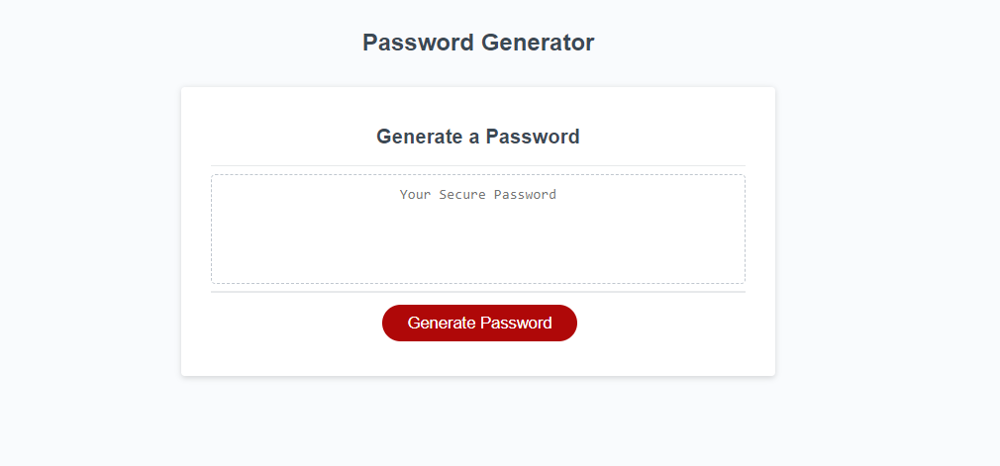

# Random Password Generator

The purpose of this application is to generate strong and secure passwords for anybody who needs to protect important information.  
The passwords generated through this application are completely randomized with a nearly infinite amount of possible outcomes.  
No passwords generated through this site are stored in any way to ensure your protection.

To launch the Random Password Generator, click [here](https://dakotablanchard.github.io/password-generator/)

By following the link, you will be taken to a website that looks like the following image:

## How to use

<ul>
<li>Step 1: Click on the red 'Generate Password' button.</li>

<li>Step 2: Once you have clicked the button, answer the following prompts that will appear on the screen:</li>
    <ol>
     <li>"How long do you want your password to be? Enter a number 8-128"</li>
     <li>"Do you want to include lowercase letters? Okay for yes, Cancel for no"</li>
     <li>"Do you want to include uppercase letters? Okay for yes, Cancel for no"</li>
     <li>"Do you want to include numbers? Okay for yes, Cancel for no"</li>
     <li>"Do you want to include special characters? Okay for yes, Cancel for no"</li>
    </ol>

<li>Step 3: Once all prompts are answered correctly, your newly generated password will appear in the text box.</li>
</ul>

## Credits

[SOURCE STARTER CODE](https://github.com/coding-boot-camp/friendly-parakeet)

[Pop up prompts in JavaScript](https://www.w3schools.com/js/js_popup.asp)

[For loops](https://www.w3schools.com/js/js_loop_for.asp)

<u>Videos watched on building a random password generator:</u>

[How to Generate a RANDOM STRING in JavaScript and HTML](https://www.youtube.com/watch?v=jww3V2fSQyg&t=234s)

[Basic JavaScript #13: alert/prompt/confirm](https://www.youtube.com/watch?v=ZmRYan3lAIo)

[How To Generate a Random Password Using JavaScript | Password Generator JavaScript Project](https://www.youtube.com/watch?v=Xrsb9SiF3a8&t=1051s)

[Random Password Generator in JavaScript](https://www.youtube.com/watch?v=v2jfGo7ztm8&t=1244s)

[Random Password Generator in JavaScript: Beginner Tutorial](https://www.youtube.com/watch?v=m5XF1OQ6rSg&t=232s)

[Build A Password Generator With JavaScript - Tutorial](https://www.youtube.com/watch?v=iKo9pDKKHnc)